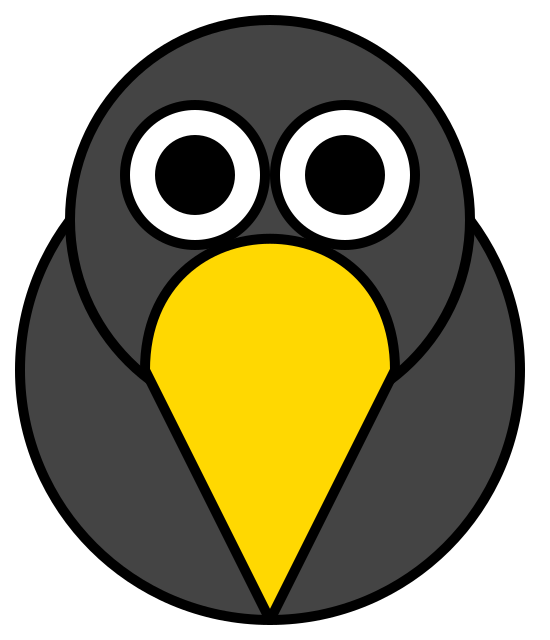

<!-- Improved compatibility of back to top link: See: https://github.com/othneildrew/Best-README-Template/pull/73 -->

<!--
*** Thanks for checking out the Best-README-Template. If you have a suggestion
*** that would make this better, please fork the repo and create a pull request
*** or simply open an issue with the tag "enhancement".
*** Don't forget to give the project a star!
*** Thanks again! Now go create something AMAZING! :D
-->

<!-- PROJECT SHIELDS -->
<!--
*** I'm using markdown "reference style" links for readability.
*** Reference links are enclosed in brackets [ ] instead of parentheses ( ).
*** See the bottom of this document for the declaration of the reference variables
*** for contributors-url, forks-url, etc. This is an optional, concise syntax you may use.
*** https://www.markdownguide.org/basic-syntax/#reference-style-links
-->
[![Contributors][contributors-shield]][contributors-url]
[![Forks][forks-shield]][forks-url]
[![Stargazers][stars-shield]][stars-url]
[![Issues][issues-shield]][issues-url]
[![LinkedIn][linkedin-shield]][linkedin-url]
<!--
[![project_license][license-shield]][license-url]
-->

<!-- PROJECT LOGO -->
 

  

<h3 align="center">corbie.dev</h3>

  

    developers best buddy
  

<!-- TABLE OF CONTENTS -->

  
Table of Contents

  <ol>
    <li>
      <a href="#about-the-project">About The Project</a>
      <ul>
        <li><a href="#built-with">Built With</a></li>
      </ul>
    </li>
    <li><a href="#contact">Contact</a></li>
  </ol>

<!-- ABOUT THE PROJECT -->
## About The Project

[![Product Name Screen Shot][product-screenshot]](https://corbie.dev)

I've started this project with one thought in my mind. I thought there are so many pages with usefull tools but not one that provides more then one different tools. Many years passed, many ideas were scrapped but in 2011 i registered the domain codecorbie.com and re-branded as corbie.dev in 2025. And started to take it more serious. It started with a HEX2RGB and RGB2HEX converter and with some pride I'd say I've come a long way since then.

Every now and then I stumble over a task that I think I could provide a tool for. So Corbie will grow bigger over time.

Over time the page served another purpose aswell. Originally written in Javascript, then Typescript, then VueJS and now Angular it should also serve as a proof of what I'm able to do besides what I do professionally. I can't show you my code as it belongs to my employer, but i can show you this.

(<a href="#readme-top">back to top</a>)

### Built With

Angular

### Tested With

<ul>
  <li>Sonarqube</li>
  <li>Lighthouse</li>
</ul>

(<a href="#readme-top">back to top</a>)

<!-- CONTACT -->
## Contact

Michael Holzer - [@linkedin][linkedin-url] - michael@die-holzers.at

Project Link: [https://corbie.dev](https://corbie.dev)

(<a href="#readme-top">back to top</a>)

<!-- MARKDOWN LINKS & IMAGES -->
<!-- https://www.markdownguide.org/basic-syntax/#reference-style-links -->
[contributors-shield]: https://img.shields.io/github/contributors/mholzer78/codecorbie.svg?style=for-the-badge
[contributors-url]: https://github.com/mholzer78
[forks-shield]: https://img.shields.io/github/forks/mholzer78/codecorbie.svg?style=for-the-badge
[forks-url]: https://github.com/mholzer78/codecorbie/network/members
[stars-shield]: https://img.shields.io/github/stars/mholzer78/codecorbie.svg?style=for-the-badge
[stars-url]: https://github.com/mholzer78/codecorbie/stargazers
[issues-shield]: https://img.shields.io/github/issues/mholzer78/codecorbie.svg?style=for-the-badge
[issues-url]: https://github.com/mholzer78/codecorbie/issues
[license-shield]: https://img.shields.io/github/license/mholzer78/codecorbie.svg?style=for-the-badge
[license-url]: https://github.com/mholzer78/codecorbie/blob/master/LICENSE.txt
[linkedin-shield]: https://img.shields.io/badge/-LinkedIn-black.svg?style=for-the-badge&logo=linkedin&colorB=555
[linkedin-url]: https://www.linkedin.com/in/mholzer78/
[product-screenshot]: public/assets/screenshot.png
[Next.js]: https://img.shields.io/badge/next.js-000000?style=for-the-badge&logo=nextdotjs&logoColor=white
[Next-url]: https://nextjs.org/
[React.js]: https://img.shields.io/badge/React-20232A?style=for-the-badge&logo=react&logoColor=61DAFB
[React-url]: https://reactjs.org/
[Vue.js]: https://img.shields.io/badge/Vue.js-35495E?style=for-the-badge&logo=vuedotjs&logoColor=4FC08D
[Vue-url]: https://vuejs.org/
[Angular.io]: https://img.shields.io/badge/Angular-DD0031?style=for-the-badge&logo=angular&logoColor=white
[Angular-url]: https://angular.io/
[Svelte.dev]: https://img.shields.io/badge/Svelte-4A4A55?style=for-the-badge&logo=svelte&logoColor=FF3E00
[Svelte-url]: https://svelte.dev/
[Laravel.com]: https://img.shields.io/badge/Laravel-FF2D20?style=for-the-badge&logo=laravel&logoColor=white
[Laravel-url]: https://laravel.com
[Bootstrap.com]: https://img.shields.io/badge/Bootstrap-563D7C?style=for-the-badge&logo=bootstrap&logoColor=white
[Bootstrap-url]: https://getbootstrap.com
[JQuery.com]: https://img.shields.io/badge/jQuery-0769AD?style=for-the-badge&logo=jquery&logoColor=white
[JQuery-url]: https://jquery.com 